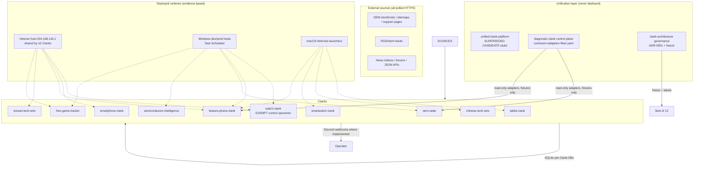
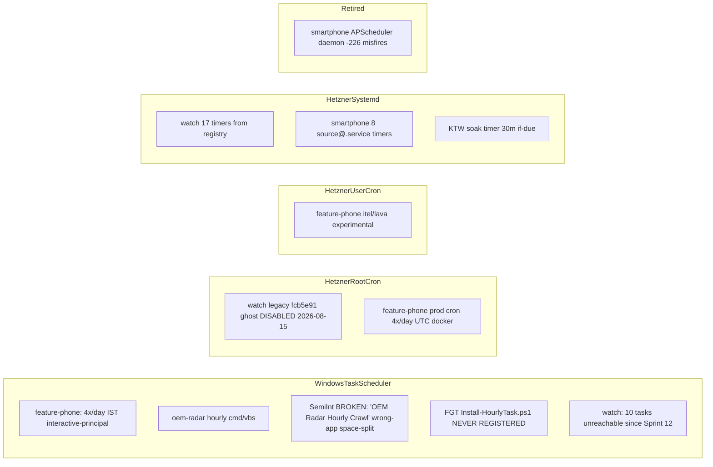

# GRAND CLANK ARCHITECTURE MAP — 2026-08-21 (audited 2026-08-22)

Phase 1C/1N deliverable. Per-Clank data flow, scheduler flow, delivery flow, shared/copied architecture, unification dependencies.

## Fleet-level topology

**Key structural fact:** every Clank is an independent runtime with its own SQLite DB. There is **no shared database anywhere**. The only inter-Clank coupling is co-location on the Hetzner host and the (optional, never-installed) `clank_runtime` contract package bridged by `runtime_bridge.py` in six repos.

## Per-Clank data flow (source → operator)

### watch-clank (control specimen)
collectors(17) → Observation → epoch/baseline gate (`epoch.py` start/complete_baseline) → novelty classification (`editorial.py`: FIRST_SEEN_BY_CLANK vs NEW_REFERENCE; `freshness.py::classify_baseline_product_freshness` 72h window) → Event (+score) → QC review (5 dispositions, history-preserving) → Discord editorial/health split channels → loopback dashboards. Provenance: run_id threading + three-way SHA match (git=OCI=runtime). Coordination: `run_lock.py` (238 lines, fleet's strongest).

### smartphone-clank
sitemap/category/support collectors (8 prod, all catalogue-inventory) → per-OEM model_validator (VALID/INVALID/AMBIGUOUS) → resolver identity (manufacturer|model_number UNIQUE) → timeline_events append-only → confidence weights+decay → alerts/eligibility reason-allowlist fail-closed → webhook_deliveries persisted THEN alerts row (= delivered) → FastAPI dashboard/dossier. Baseline: wave1 per-source epochs; suppression tested parametrized. Coordination: kernel file lock serializing systemd one-shots.

### smartwatch-clank
14 collectors (4 PROD Samsung catalogue+support; 10 EXPERIMENTAL incl Garmin 4324-page catalogue, Amazfit Shopify, Coros Zendesk) → health assessment (`assess_catalogue`) → diff → store.save_run transactional → CLI/dashboard. Run scope: tier∈{PRODUCTION,EXPERIMENTAL} × allowlist two-gate. Notifications: **NotImplementedError**. Provenance: run_uuid/app_version/schema_version/config_fingerprint/git_revision columns.

### feature-phone-clank
HMD listings+sitemap-dtc regex+PimSpec JSON → runner catastrophic-zero gate → pipeline diff → removal-after-3-absences → SQLite v4 events w/ dedup_key partial index → **no notification path at all on main** (PR #6 outbox unmerged). Scope allowlist = promotion wall; experimental runner never checks scope by design but writes separate DB+lock+volume.

### tablet-clank
URL → Collector.fetch → Candidate → validate (blocklists/identifier rules) → identity_key(manufacturer|model|region|connectivity|ram|storage) → SQLite products/observations/rejected_candidates/change_events/source_state → JSONL logs var/. One-shot baseline on first accepted run; zero-accepted fails closed. No scheduler, no notifications (ALERTS_ENABLED=False hard-fail guard).

### korean-tech-wire
index discovery → reject-before-fetch filter (per-source editorial filters) → DiscoveredArticle → conditional detail fetch → extraction → articles UNIQUE(source_id,canonical_url) upsert preserving first_seen_at → source_run_health append-only → CLI/dashboard. Status lifecycle EXPERIMENTAL→PRODUCTION in sources.yaml; empty allowlist fails closed. No events/no notifications by explicit policy.

### chinese-tech-wire
9 news + 3 community + 2 documentary sources → full_cycle: normalize→dedupe→score→cluster → StoryLeads rebuild → Discord gated by thresholds (community/documentary 75) → IngestionRun/SourceRun telemetry → FastAPI GUI. Health: self-healing BLOCKED classification. Secrets: env-only + redaction module (Phase 0); macOS launcher strips DISCORD_WEBHOOK_URL/GEMINI_API_KEY/TRANSLATION_API_KEY and forces CTW_DISABLE_COLLECTOR_LAUNCH=1.

### oem-radar
28 OEM descriptors → engines {shopify×12, sitemap_jsonld×4, woocommerce×3, category_jsonld, dell(disabled)} → normalize→validate→resolve(aliases/knownhw)→snapshot append-only→diff severity scoring→story correlation→outbox row (severity<3 or baseline ⇒ suppressed at insert)→drain Discord (attempts<5). Evidence subsystem (PSREF/Lenovo) parallel + INERT — not wired into runs. Dashboard auto_crawl_on_start=true: opening the UI is a crawl+notify actor. alert_reviews QC tables exist but EMPTY (never used).

### free-game-tracker
7 fetchers fault-isolated → Pydantic NewsEvent → dedupe/event_key(title-hashed) → compare() new/ending_soon/expired vs snapshot-sync DB (**no history table**) → quality gate → category-split Discord w/ DeliveryOutcome accounting → dashboard. Breakouts/deals lanes bypass compare() keyed appid-not-in-previous. Deployment ledger append-only with OCI provenance since cec034695d52.

### semiconductor-intelligence
RSS provider(+X Playwright off)+discovery → SignalItem(+media) → cluster/score/independence → SignalCandidate → manual promotion → EditorialStory/Evidence(content-hash immutable) → Claim engine suggestions → ClaimEvent append-only. OperationalScheduler leases + HealthService heartbeat (last_scheduler_invocation ≠ last_successful_job_commit). Vendored dead src/oem_radar for tests only — zero runtime boundary.

## Scheduler flow map

## Shared / copied architecture propagation graph

| Component | Origin | Copies | Divergence | Strongest | Stale copies |
|---|---|---|---|---|---|
| run_lock.py | unclear (oem-radar lineage) | oem-radar, **semi-int src/oem_radar (byte-identical, 0 diff)**, feature-phone, free-game-tracker, watch (238-line strongest), smartphone locks.py, KTW locking.py | fgt↔fpc 267-line divergence; KTW minimal 43-line; watch adds stale-reclaim+heartbeat | watch-clank | semi-int copy frozen w/ dead fork |
| crawl-hourly.cmd family | OEM Radar | semint (regressed: auto pip install in scheduled run), FGT/SemInt .cmd vocabulary | semint regressed the fail-loud dependency check oem-radar fixed | oem-radar | semiconductor-intelligence |
| install-hourly-task.cmd | OEM Radar | semint regressed to known-broken schtasks /tr space-split pattern registering WRONG APP NAME | documented root-cause essay exists only in oem-radar's fixed copy | oem-radar | semiconductor-intelligence (P0-class footgun) |
| runtime_bridge.py (optional clank_runtime bridge) | unified-clank-platform Stage 1a pattern | 6 repos: FGT, CTW, oem-radar, smartwatch, feature-phone, semint | all optional try/except; FGT most complete (health semantics+provenance); ingestion_state always UNKNOWN | free-game-tracker | none installed clank_runtime anywhere |
| Phase 0 banner + containment CI (gitleaks/blackhole-proxy CI/requirements.lock) | Phase 0 effort 2026-08-21 | all 10 domain repos | identical pattern | n/a | phase0 branches dangling everywhere |
| Outbox/delivery-accounting | oem-radar notifications table | smartphone webhook_deliveries, FGT DeliveryOutcome, diagnostic contracts/delivery.py | vocab drift: v3 quotes EVENT_CREATED/DELIVERY_PENDING which exist NOWHERE in oem-radar (pending/sent/failed/suppressed/demoted) | oem-radar impl; diagnostic contracts | v3 doc naming |
| SQLite schema shape (products/observations/events/runs/source_state) | convergent evolution | all 8 domain Clanks | first_seen immutability convention varies; only watch has epoch table | watch (epochs), smartphone (baseline_state) | tablet migrations stub |
| Source-promotion lifecycle | KTW (documented protocol) | smartphone scope gates, smartwatch stage gates, tablet roster-freeze | KTW only one with written policy+per-source yield log | KTW | others implicit |

## Unification dependencies (who references whom)

- `clank_runtime` imports: ZERO hard dependencies fleet-wide. All bridges optional try/except; feature-phone test actively skips when installed ("currently only … not installed anywhere" — runtime_bridge.py:53-67).
- diagnostic-clank adapters point at real sibling DB paths via env vars (`OEM_RADAR_DB`, `FEATURE_PHONE_CLANK_DB`) but are fixture-proven only.
- clank-architecture README links diagnostic-clank fleet.yaml as canonical inventory.
- Dockerfiles cite "pattern proven on OEM Radar / Chinese Tech Wire / Feature Phone Clank / Smartwatch Clank / Watch Clank" (smartphone Dockerfile:32-33) — folklore coupling, not code coupling.
